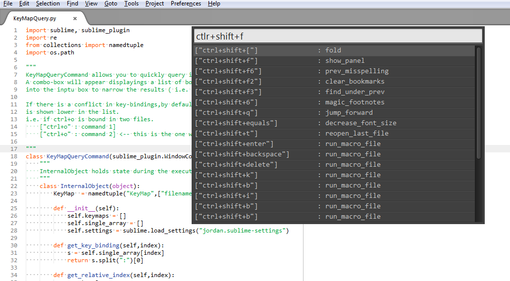
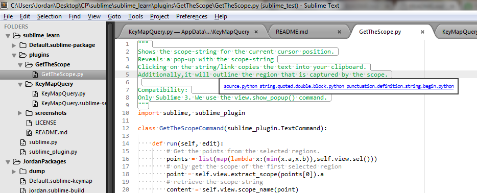

Author: Jordan Yu  
Date: May 16th, 2015  

#Purpose:
This repository holds various sublime plugins that I developed in order to alleviate paint points in my daily sublime usage. Most of this stuff is brutally brittle. I only really want the plugins to work on my system, and only for my current version of sublime. I try to document my code as much as I can so that if anybody does stumble-upon it, they atleast have some chance modifying it for themselves.

#Plugins List
##KeyMapQuery
Plugin which allows you to quickly check if a key-binding is currently being 
used in sublime. A combo-box will appear displaying a list of bound key-
bindings. Type a key-combination into the input box to narrow the results
( i.e. ctrl+k,ctrl+i ).If there is a conflict in key-bindings the default behavoiur is to show the highest precendence match lower in the list. 

    For Example:
    if ctrl+o is bound in two files.
    ["ctrl+o" : command 1]
    ["ctrl+o" : command 2] <-- this is the one which actually gets used.

Internally this plugin will find and load all sublime-keymap files. It parses 
them into python objects and then displays the key-bindings using the window.
show\_quick\_panel(). Selecting one of the entries fires off the "open_file" command and opens up the sublime-keymap file in a new view.

##GetTheScope
Plugin which shows a popup of the _scope_ string of the currently selected text.This is to make my life easire when trying to develop plugins whcih needs _context_ information for the command.

##Misc
###RenameCurrentView 
    hotkey command to rename the currently opened view.
###ExpandtoString
	 command to wrap the closest quoted text.
